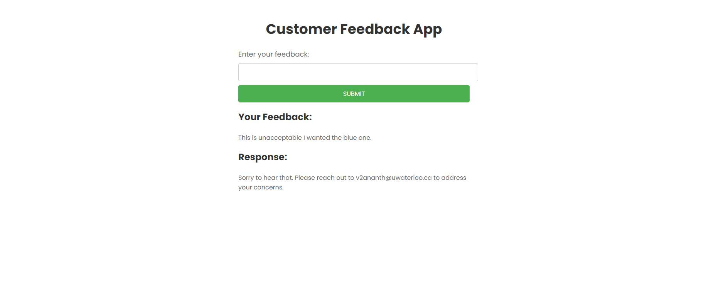

# FeedbackNLPCohere
Sentiment analysis feedback app that determines wether the user is happy or unhappy with the service based on their feedback using Cohere, and prompts them accordingly.

- Made using Flask, Cohere API (Sentiment Analysis)

### Steps to Run

In CLI run, it will serve the app on localhost:5000
```
python main.py
```




